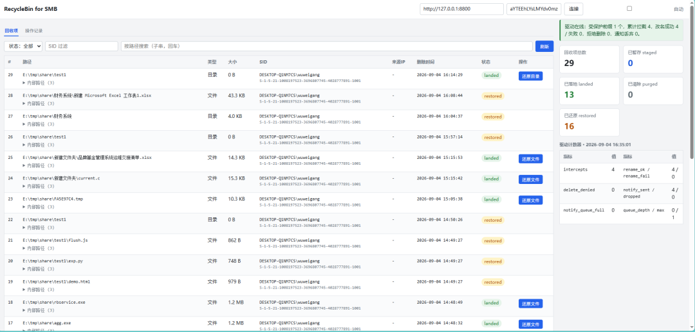

<div align="center">

# Windows File Share Recycle Bin

**RecycleBin for SMB**

Intercepts delete operations on SMB shares and redirects the files into a
staging recycle area instead of deleting them for real, giving you
**remote delete → recycle bin → restorable / auditable**.

[简体中文](README.md) | English

</div>

<div align="center">


-orange)


</div>

**Zero awareness, zero changes on the client side**: the user presses Delete in
Explorer, the file "disappears", and it actually lands in their own
`$Recycle.Bin` — restorable with the standard Recycle Bin.

---

> ## ⚠️ Production readiness
>
> The architecture and data model have been hardened for production, but you
> **must understand these two points before deploying**:
>
> | Item | Status | Notes |
> |---|---|---|
> | **Driver signing (dev/test)** | ✅ Supported | `build_all.cmd` signs automatically with the project test cert `F57B8149…`; if signtool or the cert is unavailable it only warns and falls back to `testsigning` mode |
> | **Driver signing (production)** | ❌ Blocking | Production requires an **EV certificate + Dev Center attestation / WHQL** (2–6 week external process). The project test cert does not satisfy compliance baselines |
> | **Kernel path validation** | ⚠️ Insufficient | Driver-side fixes have only been validated by **compilation and contract tests**, not by delete stress testing on a machine with Driver Verifier |
>
> See [Production readiness](#production-readiness) and
> [docs/buglist.md](docs/buglist.md) (Chinese).

---

## Table of contents

- [Features](#features)
- [Architecture](#architecture)
- [Workflow](#workflow)
- [Repository layout](#repository-layout)
- [Quick start](#quick-start)
- [Deployment](#deployment)
- [Configuration reference](#configuration-reference)
- [REST API](#rest-api)
- [Web console](#web-console)
- [Operations and monitoring](#operations-and-monitoring)
- [Troubleshooting](#troubleshooting)
- [Known limitations](#known-limitations)
- [Development](#development)
- [Production readiness](#production-readiness)
- [Documentation index](#documentation-index)
- [License](#license)

---

## Features

<table>
<tr>
<td width="50%" valign="top">

### Interception and redirection

| Feature | Notes |
|---|---|
| **Kernel-level interception** | Mini-Filter (Altitude `370030`) hooks the delete I/O path; no shell hooks |
| **No user-mode round trip** | Redirection completes synchronously in kernel mode; the delete path never blocks waiting on user mode |
| **Fail-closed protection** | When staging fails it **denies the delete** and keeps the data (switchable back to fail-open); no silent real deletes |
| **Variable-length notifications** | Notifications are allocated from the kernel pool on demand (typically ≈1 KB) instead of a fixed 64 KB structure |
| **Reserve-then-enqueue** | The queue slot is reserved **before** the rename, so a full queue means the file was never touched — **orphans are structurally impossible** |

</td>
<td width="50%" valign="top">

### Landing and operations

| Feature | Notes |
|---|---|
| **Standard Recycle Bin compatible** | Lands as `$Recycle.Bin\<SID>\$Rxxxx` + `$Ixxxx`; users restore with native Explorer |
| **Real user attribution** | The kernel reads the **real client SID** via `TokenUser`; no guessing from session ID |
| **Orphan reconciliation** | Periodic scan of the staging area reclaims ownerless files, with a configurable grace period, so the share volume cannot fill up |
| **Online backup** | SQLite online backup API + integrity check, **verify before backup**, never overwrites the last good copy |
| **Automatic housekeeping** | Quota, retention and multi-volume disk watermark cleanup; terminal-state rows are archived automatically |
| **Hot config reload** | User-mode config can be reloaded online without restarting the service |

</td>
</tr>
</table>

### Security features

| Feature | Notes |
|---|---|
| **Restore path allowlist** | The restore target must fall inside a protected share; `..` traversal and UNC/device paths are rejected |
| **SYSTEM boundary narrowed** | Path validation lives in the C side that actually performs the rename, not in a caller that can be bypassed |
| **Fail-fast contract** | Driver ↔ service structs carry **compile-time static assertions**; a layout mismatch breaks the build |
| **Single-writer model** | Go opens the database with `mode=ro`, so it **physically cannot corrupt metadata** |

---

## Architecture

```
Remote client (\\server\share)
   Explorer delete → SMB2 → srv2.sys → local IRP
                              │
                              ▼
        rbminiflt.sys  (Mini-Filter, Altitude 370030)
          PreSetInfo(DeleteFile=1):
            1. Does the path match a protected prefix?  (NT-form prefix match, uppercased)
            2. Get the requestor's real SID     (TokenUser)
            3. Reserve a notification queue slot ← full ⇒ deny delete, file untouched
            4. Rename to <same volume as share>\RBStore\<Sid>\<seq>_<basename>
            5. Success → COMPLETE(STATUS_SUCCESS)  // user thinks it's gone
            6. Failure → fail-closed deny (default) + counter
            7. Async enqueue notify → comm port \RecycleBinPort
                              │
                              ▼
        RecycleBinSvc = rbservice.exe (C, SYSTEM, sole filesystem writer)
           port thread    read notify → write SQLite metadata (status=staged)
           maint thread   staging → same-volume $Recycle.Bin (status=landed)
                          quota / expiry / multi-volume watermark cleanup
                          orphan reconciliation + terminal archiving + DB backup
           ops thread     consume ops table to perform restores (2s poll)
           graceful stop  run one last landing pass before STOP
                              │
                              ▼
                        recycle.db (SQLite, WAL)
                              ▲
                              │  read-only queries + ops enqueue
        RecycleBinApi = rbapi.exe (Go, optional, 127.0.0.1)
           - never touches the filesystem
```

### How the two services stay decoupled

They use **shared SQLite + separate processes**:

| Contract | Mechanism |
|---|---|
| Process isolation | One crashing does not affect the other; if Go dies, C keeps intercepting |
| Filesystem | Go opens `items` with `mode=ro`, so it **physically cannot corrupt metadata** |
| Command passing | Go inserts requests into the `ops` table; C executes and writes back `state`/`message` |
| Business rules | "Can this be restored" and "is the target legal" are decided only by C; Go does not duplicate that logic |
| DB schema | `db/schema.sql` is the single source of truth; C creates tables, Go validates at startup |
| Version agreement | `user_version` check; on mismatch **both sides refuse to start** |

> Decoupling buys process-level stability at the cost of a data contract. The
> last three rows above are what pull that contract back from "silent runtime
> failure" to "fail fast at startup".

### Why "kernel rename + COMPLETE" instead of "ask user mode"

The old pattern of "intercept → ask user mode whether to delete" cannot
implement a recycle bin:

- `ALLOW` → the file is already gone, too late to move it
- `DENY` → the delete is cancelled, and user mode moving it afterwards
  **re-enters this very driver callback** → recursion / loop

The new pattern renames directly in the pre-callback and then COMPLETEs the
DELETE request as success, which removes the loop and the race at the root.

---

## Workflow

### Two-phase landing

```
Phase 1 (kernel, synchronous)   D:\Share\a.txt  ──rename──▶  D:\RBStore\S-1-5-21-...\42_a.txt
                                                              ↓ notify
                                                      SQLite: status='staged'

Phase 2 (user mode, within 30s) D:\RBStore\...\42_a.txt ──rename──▶ D:\$Recycle.Bin\S-1-5-21-...\$Rxxx.txt
                                                              + write $Ixxx.txt metadata
                                                      SQLite: status='landed'
```

Both phases are a **same-volume rename** — atomic, zero-copy, instant. Phase 2
is picked up asynchronously by the maintenance thread, so a driver crash still
cannot lose a file (it just stays in staging).

### State machine

```
        ┌──────────────┐
        │  (new item)  │
        └──────┬───────┘
               ▼
          ┌────────┐   maint thread landed ok   ┌────────┐
          │ staged │ ─────────────────────────▶ │ landed │
          └────────┘                            └────┬───┘
               │                                     │
               │  expired/watermark/over quota       │ restore / expired / watermark / over quota
               ▼                                     ▼
          ┌────────┐                           ┌──────────┐
          │ purged │                           │ restored │
          └────────┘                           └──────────┘
               │                                     │
               └──────────────┬──────────────────────┘
                              │ row deleted by archive after audit period
                              ▼
                        (row removed)
```

> Terminal rows (`purged` / `restored`) are kept for `TerminalKeepDays`
> (default 90 days) as an audit record and then archived, so the table cannot
> grow without bound.

---

## Repository layout

```
recyclebin_svc/
  driver/                     kernel Mini-Filter driver (WDK)
    rbminiflt.c                 driver core (intercept/redirect/notify/port)
    rbminiflt.h                 shared structs and constants (variable-length notify layout)
    rbminiflt.inf               install info (includes Altitude 370030)
    rbminiflt.vcxproj           driver project
    build.cmd                   command-line build script
  service_c/                  core service (C, SYSTEM, zero runtime deps)
    rbservice.c                 SCM entry + graceful stop + maint/ops threads
    rbdb.c                      SQLite wrapper (WAL, single writer, backup, archive)
    rbstore.c                   $Recycle.Bin landing + $I metadata
    rbpolicy.c                  quota / expiry / multi-volume watermark
    rbrestore.c                 restore execution + target path allowlist validation
    rbconcile.c                 staging-area orphan reconciliation
    rbport.c                    kernel comm port reader
    rbvol.c                     NT<->DOS volume mapping + SID resolution
    rbconfig.c                  registry config + hot reload
    rblog.c                     Windows event log
    rbf_protocol.h              protocol structs + compile-time layout assertions
    schema_sql.h                [generated] from db\schema.sql
    sqlite3.c/h                 [downloaded] fetched automatically at build time
  service_go/                 management REST API (Go, optional)
    main.go                     config + graceful shutdown
    api/api.go                  7 HTTP endpoints + token auth
    db/db.go                    read-only queries + ops enqueue
  db/
    schema.sql                  **single source of truth for the DB schema**
    gen_schema.ps1              generates service_c/schema_sql.h
    verify_contract.py          C <-> Go contract verification (9 checks)
    verify_c_contract.py        C service contract verification (7 checks)
  docs/
    design.md                   design notes (paradigm choice/comm model/limits) [Chinese]
    bugfix-report.md            historical fixes from the original Python implementation [Chinese]
    buglist.md                  open issues and remediation schedule [Chinese]
    bugfix-production.md        production readiness fix record [Chinese]
  build_all.cmd               one-shot build (collects output into target\)
  deploy.ps1                  one-shot deployment script (admin)
  recyclebin_svc.sln          VS solution
  README.md                   Chinese README
  README.en.md                this file
```

---

## Quick start

> ⚠️ **Read this first**: `StoreRoot` must be on the **same volume** as the
> protected share (a kernel rename cannot cross volumes). Configuring the wrong
> volume leads to denied deletes or real deletes. See
> [Known limitations](#known-limitations).

```powershell
# 1) Enable test signing (required while the driver is not properly signed), then reboot
bcdedit /set testsigning on
Restart-Computer

# 2) Build all three components (output collected into target\Release\)
cd c:\RecycleBin\smb_intercept\recyclebin_svc
.\build_all.cmd Release

# 3) Edit the config (make sure StoreRoot is on the same volume as the share!)
notepad .\deploy.ps1

# 4) Deploy with an elevated PowerShell
powershell -ExecutionPolicy Bypass -File .\deploy.ps1
```

`target\Release\` is a **self-contained deployment package** you can copy
straight to the target machine:

```
target\Release\
  rbminiflt.sys    kernel driver
  rbminiflt.inf    driver install info
  rbservice.exe    core service
  rbapi.exe        management API (when Go is available)
  deploy.ps1       deployment script
```

---

## Deployment

### Prerequisites

| Item | Requirement |
|---|---|
| OS | Windows Server 2016+ / Win10 1809+ (x64) |
| Privileges | elevated PowerShell |
| Build tools | VS2022 + WDK 10 (driver, C service); Go 1.22+ (optional API); PowerShell (schema generation, build time only) |
| Runtime deps | **None.** The core service is a native exe; the target server needs no Python / .NET / Go runtime |

### Deployment steps

`deploy.ps1` runs 7 phases (1 precheck + 6 execution steps):

| Step | Action |
|---|---|
| **[0/6]** | Verifies `StoreRoot` is on the **same volume** as the protected share; aborts with a copy-pasteable fix if not |
| **[1/6]** | Converts `D:\Share` to NT form `\Device\HarddiskVolumeN\Share` via `QueryDosDevice` and writes it to the driver parameter key and the user-mode config key |
| **[2/6]** | Creates `StoreRoot` (e.g. `D:\RBStore`), adds `HIDDEN\|SYSTEM` attributes so share users cannot see it |
| **[3/6]** | Copies sys to `system32\drivers\`, runs `pnputil /add-driver ... /install` (**INF install requires a digital signature; if unsigned it fails and automatically falls back to legacy registration, which requires testsigning to be on** — see "Driver signing" section B) |
| **[4/6]** | `sc start rbminiflt`; on load failure the exit code distinguishes: **0xC0000428 (unsigned)** → see "Driver signing" below, switch to test signing or re-sign with a production cert |
| **[5/6]** | `sc create RecycleBinSvc ... obj= LocalSystem start= auto` and starts it |
| **[6/6]** | Installs the management API `rbapi.exe` (optional; skipped if not built) |

### Using the deployment package (recommended)

`build_all.cmd` collects the driver, service, INF and `deploy.ps1` into
`target\Release\`, making it a self-contained package:

```powershell
# Build on the dev machine
.\build_all.cmd Release

# Copy to any location on the target, e.g. D:\Deploy
xcopy /s /i target\Release D:\Deploy

# Run elevated on the target
cd D:\Deploy
powershell -ExecutionPolicy Bypass -File .\deploy.ps1
```

When run from inside the package, `deploy.ps1` prefers the binaries in **its own
directory**, so it never needs the source tree.

### Driver signing

Whether the driver loads depends on **which kind of certificate signed it** and
the target machine's load policy.

**A. Project test certificate (dev/test, default)**

After linking, `build_all.cmd` calls signtool automatically and **embeds a
signature** using the project signing cert (`F57B8149…`, see `CERT_THUMBPRINT`
at the top of `build_all.cmd`). The certificate export password is passed via
the `RB_CERT_PWD` environment variable:

```cmd
set RB_CERT_PWD=your-cert-password
build_all.cmd Release          # sign by default
build_all.cmd Release nosign   # explicitly skip signing (only for pure test-signing debugging)
```

- This is a **self-signed test certificate**, trusted only in test signing mode;
  it does not satisfy production baselines / compliance.
- If the build machine **lacks signtool or the cert is unavailable**,
  `build_all.cmd` does not abort; it prints
  `WARNING: signtool missing or cert unavailable, driver left unsigned` and
  yields an unsigned binary — the target must then enable test signing
  (see B) to load it.

**B. Test signing mode (test machines only)**

With no production cert, when you need to load an unsigned or test-signed
driver, enable test mode on the target:

```cmd
# requires admin, takes effect after reboot
bcdedit /set testsigning on
# to disable:
bcdedit /set testsigning off
```

> ⚠️ **Key gotcha (verified): `testsigning` only exempts the kernel loader, not
> setupapi's INF package signature check.** Deployment goes through
> `pnputil /add-driver ... /install` (step [3/6]), where setupapi still requires
> a **valid digital signature** on `.inf/.cat/.sys`. With only testsigning on and
> an unsigned driver, `pnputil` fails with `Access is denied`, and then [4/6]
> `sc start` reports `1060` (service not registered).
> So "testsigning alone is not enough, you must sign" is a real constraint, with
> two viable paths:
> - **(A) Sign with the project test cert, then install**:
>   `set RB_CERT_PWD=...; build_all.cmd Release` → `.sys/.cat` get signed and
>   `pnputil` passes on a testsigning machine (the proper INF install path);
> - **(B) Skip INF install, fall back to legacy**: after `pnputil` fails,
>   `deploy.ps1` automatically does `sc create` + copies `sys` to register
>   directly, relying only on the kernel loader, so testsigning alone loads the
>   unsigned driver. Functionally equivalent, but it **does not use the proper
>   INF install** — testing/troubleshooting only.

> Production servers **must never** leave test signing enabled (it violates the
> baseline and lets any test-signed driver load).

**C. Production certificate (required for go-live, currently blocking)**

Production deployment requires switching to an **EV code signing certificate**
and completing one of the following so the chain is trusted by stock Windows:

- **attestation signing** (Dev Center cross-platform driver attestation, the
  fastest path, no HLK lab required);
- **WHQL / HLK certification** (enters the Windows Update catalog, longer cycle).

The external process (buy EV cert + Dev Center certification) takes about
**2–6 weeks** and is the critical-path blocker for go-live (see buglist RB-02).
Until then the driver only loads on test-signing machines.

> Deployment check hint: at [3/6], `deploy.ps1` raises a **red banner** when
> `pnputil` fails (setupapi validation is not exempted by testsigning) and
> automatically falls back to legacy registration; if [4/6] `sc start` still
> fails, pick the matching path from A/B/C above (re-sign / confirm testsigning
> is on and rebooted / use an EV cert).

### Verify the deployment

```powershell
# driver loaded and attached to the volume
sc.exe query rbminiflt
fltmc filters | Select-String rbminiflt
fltmc instances -f rbminiflt

# service running
sc.exe query RecycleBinSvc

# REST health check
Invoke-RestMethod "http://127.0.0.1:8800/health" -Headers @{"X-Auth-Token"="change-me"}
```

### End-to-end smoke test

```powershell
# client: delete a test file from \\server\share

# server: confirm staging -> landing
dir D:\RBStore /s
Invoke-RestMethod "http://127.0.0.1:8800/items?limit=10" -Headers @{"X-Auth-Token"="change-me"}

# client: open the Recycle Bin, the file should be visible and natively restorable
```

### Uninstall / rollback

```powershell
sc.exe stop RecycleBinSvc;  sc.exe delete RecycleBinSvc
sc.exe stop rbminiflt
pnputil /delete-driver rbminiflt.inf /uninstall /force
del C:\Windows\System32\drivers\rbminiflt.sys
Remove-Item D:\RBStore -Recurse -Force
reg delete "HKLM\SOFTWARE\RecycleBin" /f
bcdedit /set testsigning off
```

---

## Configuration reference

### Driver parameters

`HKLM\SYSTEM\CurrentControlSet\Services\rbminiflt\Parameters`:

| Key | Type | Default | Notes |
|---|---|---|---|
| `ProtectedPaths` | REG_MULTI_SZ | *(written by deploy)* | Protected share roots (**NT form** `\Device\HarddiskVolumeN\...`) |
| `FailClosed` | REG_DWORD | `1` | `1` = when staging is impossible, **deny the delete** and keep the data (recommended)<br>`0` = allow the real delete (file lost forever, emergency bypass only) |

> Driver parameters are read **at driver load time**; changes require restarting
> the driver (`sc stop/start rbminiflt`).

### User-mode configuration

`HKLM\SOFTWARE\RecycleBin`:

| Key | Type | Default | Notes |
|---|---|---|---|
| `ProtectedPaths` | REG_MULTI_SZ | `D:\Share` | Protected share roots (**DOS form**; used by the service and the restore allowlist) |
| `StoreRoot` | REG_SZ | `D:\RBStore` | Staging root + SQLite DB location. **Must be on the same volume as the protected share** |
| `QuotaMB` | REG_DWORD | `5120` | Per-user recycle bin quota (MB); oldest-first cleanup when exceeded |
| `RetentionDays` | REG_DWORD | `30` | Retention in days, applies to both `landed` and `staged` |
| `DiskFreeMinMB` | REG_DWORD | `5120` | Free disk watermark (MB); below it the oldest landed items are cleaned |
| `StagedBatch` | REG_DWORD | `500` | Landing batch size per maintenance pass (loops until drained, not a per-pass cap) |
| `OrphanGraceDays` | REG_DWORD | `7` | Grace period (days) before ownerless staging files are reclaimed |
| `TerminalKeepDays` | REG_DWORD | `90` | Audit retention (days) for `restored`/`purged` rows before archiving |
| `EnableRestApi` | REG_DWORD | `0` | `1` enables the management API |
| `RestApiPort` | REG_DWORD | `8800` | API port (listens on `127.0.0.1` only) |
| `RestApiToken` | REG_SZ | *(empty)* | `X-Auth-Token`; empty means no auth |
| `PortName` | REG_SZ | `\RecycleBinPort` | Kernel comm port name |

### Hot config reload

```powershell
# user-mode config: after editing the registry, send the control code; no service restart
sc.exe control RecycleBinSvc 128
```

Hot reload **validates before swapping**: illegal values (e.g. `RetentionDays=0`,
which would delete everything immediately) are rejected and the previous config
stays in effect.

> ⚠️ Although `StoreRoot` is hot-reloadable, the DB path is fixed at startup, so
> moving storage still requires a service restart (the script prints a warning).
> Driver-side parameters (`ProtectedPaths`, `FailClosed`) are not hot-reloadable.

---

## REST API

All requests need the `X-Auth-Token` header (when `RestApiToken` is non-empty).
Listens on `127.0.0.1` only.

### Endpoint overview

| Method | Path | Notes |
|---|---|---|
| GET | `/health` | DB counts + driver connectivity |
| GET | `/stats` | Raw driver counters |
| GET | `/items` | Paged query (`limit`, `offset`, `status`, `sid`) |
| GET | `/items/{id}` | Single item detail |
| GET | `/search` | Path substring search (`q`, `limit`) |
| POST | `/ops` | Submit an operation (`restore` single / `restore-tree` directory tree) |
| GET | `/ops/{id}` | Query operation result |

### GET /health

```json
{
  "ok": true,
  "ts": 1780000000.0,
  "counts": {"staged": 3, "landed": 1200, "purged": 30, "restored": 1},
  "driver": null
}
```

`driver` being `null` means the comm port is not connected.

### GET /stats

| Field | Meaning |
|---|---|
| `ts` / `age_sec` | sample time / seconds since |
| `intercepts` | deletes that matched a protected prefix |
| `rename_ok` | successfully redirected to staging |
| `rename_fail` | failed redirections |
| `delete_denied` | **fail-closed denied deletes** (data preserved, not lost) |
| `notify_sent` / `notify_dropped` / `notify_queue_full` | notification delivery status |
| `queue_depth` / `max_queue_depth` | current queue depth / **historical peak** |

**Data source**: `rbservice` samples driver stats every 5 seconds into the
`driver_stats` table; the API reads from that table.

> The comm port has `MaxConnections = 1` and is already held by the C service, so
> the Go side **cannot query the driver directly** and must go through the DB
> snapshot — an architectural constraint, not a defect.

**Two cases return 503** (both mean "not trustworthy", not "count is zero"):

| Case | Meaning |
|---|---|
| No snapshot ever taken | driver not loaded, or service just started |
| Snapshot older than 30 seconds | **driver offline** (unloaded/crashed/port disconnected) |

> These are **cumulative counters**, so "driver not responding" and "genuinely
> zero deletes" are indistinguishable numerically. A stale snapshot therefore
> returns 503 instead of 0, so operators do not see `delete_denied = 0` and
> wrongly conclude the system is healthy.

### POST /ops

**Restore a single item**:

```json
{ "type": "restore", "id": 123 }
```

**Bulk restore by prefix (directory tree)**:

```json
{ "type": "restore-tree", "arg": "D:\\Share\\Project" }
```

Returns an operation ID; execution is asynchronous in the C service. Use
`GET /ops/{id}` for the result. Bulk restore messages look like
`restored 41/42; 1 failed (first: id=123: ...)`.

> **How to restore a deleted directory tree**
>
> SMB deletes a directory **entry by entry** (the client recurses), so a tree
> with N files and M subdirectories becomes **N+M separate items** in the
> recycle bin rather than a single directory — unlike a local Explorer delete
> (one rename of the whole tree, shown as a single directory).
>
> Use `restore-tree` to restore the whole tree at once:
>
> ```powershell
> Invoke-RestMethod "http://127.0.0.1:8800/ops" -Method Post -Headers $h `
>                   -Body '{"type":"restore-tree","arg":"D:\\Share\\Project"}' `
>                   -ContentType "application/json"
> ```
>
> Prefix matching is a **true prefix**: `D:\Share\Project` does not also match
> `D:\Share\ProjectBackup`. Cap is 5000 items per call; narrow the prefix and
> batch if you exceed it.

> **Restore target safety**: the system only accepts restoring to the
> **original path** or a target inside a protected share; paths containing `..`,
> UNC paths and device paths are rejected. This validation runs on the C side,
> and `restore-tree` prefixes are subject to it too.

### Call examples

```powershell
$h = @{"X-Auth-Token"="change-me"}
Invoke-RestMethod "http://127.0.0.1:8800/items?status=landed&limit=50" -Headers $h
Invoke-RestMethod "http://127.0.0.1:8800/search?q=report&limit=20" -Headers $h

# restore one item
Invoke-RestMethod "http://127.0.0.1:8800/ops" -Method Post -Headers $h `
                  -Body '{"type":"restore","id":123}' -ContentType "application/json"

# restore a whole tree
Invoke-RestMethod "http://127.0.0.1:8800/ops" -Method Post -Headers $h `
                  -Body '{"type":"restore-tree","arg":"D:\\Share\\Project"}' `
                  -ContentType "application/json"
```

---

## Web console

`web/index.html` is a static page you open directly in a browser (`file://`, no
deployment needed). Everything it does comes from the [REST API](#rest-api)
endpoints above. "Connect" calls `/health` once to validate the token; the list
and counts auto-refresh every 5 seconds.



> The page only renders fields that already exist and does not cache a schema;
> backend field changes show up on a plain refresh.

---

## Operations and monitoring

### Key health checks

```powershell
# 1) driver and service status
sc.exe query rbminiflt
sc.exe query RecycleBinSvc

# 2) is the staging area backing up? (not empty for a long time = landing problem)
dir D:\RBStore /s | Measure-Object

# 3) warnings in the event log (orphan reclaim, denied deletes, backup failures)
Get-WinEvent -LogName Application -Source RecycleBin* -MaxEvents 50
```

### Core metrics

| Metric | Healthy | What abnormal means |
|---|---|---|
| `rename_fail` | steady 0 | non-zero usually means the StoreRoot volume does not match or the disk is full |
| `delete_denied` | steady 0 | non-zero means the staging area is broken and deletes are being denied (**data preserved**) |
| `notify_dropped` | steady 0 | non-zero means the service is offline or comms are broken, which can create orphans |
| staging backlog | drained within 30s | a persistent backlog means landing is blocked |

Alert on all four: `delete_denied` and `notify_dropped` staying at 0 is the
healthy state, and once they start growing the staging area or service comms
need immediate investigation.

> A 503 from `/stats` is itself an important signal: it means the **driver is
> offline**, not "the count is 0". See [REST API](#get-stats).

### Timing and latency

| Phase | Latency |
|---|---|
| delete → file in staging | synchronous, milliseconds (kernel rename) |
| staging → `$Recycle.Bin` | ≤ 30s (maintenance thread period, loops until drained) |
| submit restore → execution done | ≤ 2s (dedicated ops thread) |
| landing → visible in the user's Recycle Bin | depends on Explorer refresh |

The file is **safe immediately after deletion** (already in staging); the 30s
second phase only affects when it becomes visible in the Recycle Bin.

### Logs

- **Service**: Windows event log + console mirror (in `console` mode, straight to the terminal)
- **Driver**: `DbgPrint` (view with DebugView or a kernel debugger)

### Capacity planning

- Staging holds files only briefly (≤30s); peak space depends on the delete volume inside that window
- Long-term usage lives in `$Recycle.Bin`, bounded by `QuotaMB` / `RetentionDays` / `DiskFreeMinMB`
- Landing is a rename, so it costs no extra space
- The database is backed up daily to `<StoreRoot>\recycle.db.bak` (integrity check runs before each backup)

---

## Troubleshooting

| Symptom | Cause | Fix |
|---|---|---|
| Driver fails to start | test signing off / sys unsigned | `bcdedit /set testsigning on`, then reboot |
| Deletes not intercepted | `ProtectedPaths` written in DOS form | the driver side needs NT form; restart the driver after fixing |
| **Delete denied (Access Denied)** | fail-closed is in effect, staging unavailable | check StoreRoot same-volume/permissions/disk space; look for the deny reason in the event log |
| File really deleted, nothing in the bin | `FailClosed=0` and staging failed | check the event log; confirm StoreRoot is on the same volume as the share |
| Service cannot connect to the port | driver not loaded, or `PortName` mismatch | `sc query rbminiflt`; `driver` null in `/health` means not connected |
| Files not visible in the Recycle Bin | maintenance thread has not run yet, or volume mapping failed | wait 30s; check the service log for volume resolution failures |
| User cannot restore | landed SID does not match the user's logon SID | check whether `sid` in `/items` is `S-1-5-...` |
| Restore says "target not inside a protected share" | target path validation rejected it | the target must be inside a protected share, or restore to the original path |
| Disk fills up quickly | quota/watermark thresholds too large | lower the thresholds, then `sc control RecycleBinSvc 128` |
| REST 401 | token mismatch | check the registry `RestApiToken`; hot reload after changing |
| Occasional BSOD after service restart/crash | old driver client port use-after-free ([RB-23](docs/buglist.md)) | rebuild and deploy the current driver (fixed: the queue is drained synchronously on disconnect) |

---

## Known limitations

1. **StoreRoot must be on the same volume as the protected share** — the kernel
   `FileRenameInformation` does not support cross-volume renames. Protecting
   multiple volumes requires separate deployments or a driver change
   ("copy + delete source"), which adds significant complexity and risk.
2. **Cross-volume restore is not supported** — restoring also relies on a
   same-volume rename.
3. **The driver must be signed** — the build signs automatically with the
   project test cert (`F57B8149…`), but that is trusted only under
   **test-signing**; production requires an **EV cert + Dev Center
   attestation/WHQL** (2–6 week external process, see
   [RB-02](docs/buglist.md)).
4. **Driver parameters are not hot-reloadable** — changing `ProtectedPaths` or
   `FailClosed` requires a driver restart (user-mode config is hot-reloadable,
   see [Configuration reference](#hot-config-reload)).
5. **Symlinks / hard links / reparse points are not special-cased** — they are
   redirected like ordinary files.
6. **Local deletes are intercepted too** — the decision is based on the path
   prefix (the old session-ID filter missed SMB2 deletes executed in session 0).
   Operating on a protected directory on the server itself also lands in the
   recycle bin.
7. **Driver counters have a 5-second sampling delay** — cumulative values are
   accurate, but instantaneous `queue_depth` is only the value at the sample
   point; use `max_queue_depth` for the peak.
8. **`$I` metadata uses the v1 format** — compatibility with the Windows
   Recycle Bin UI still needs hands-on confirmation
   ([RB-17](docs/buglist.md)).

---

## Development

### One-shot build (recommended)

```powershell
.\build_all.cmd Release    # or Debug / All
```

Builds the driver, C service and Go API, runs the contract checks, and collects
everything into `target\Release\`. If the Go toolchain is missing it **skips the
API build and continues** (the API is optional).

### Per-component build

```powershell
# driver
cd driver
.\build.cmd Release      # produces driver\rbminiflt.sys

# core service (regenerates DDL from db\schema.sql automatically)
cd ..\service_c
.\build.cmd Release      # produces rbservice.exe

# management API
cd ..\service_go
go build -o rbapi.exe .
```

> The C service build downloads the SQLite amalgamation from sqlite.org
> automatically (it is no longer vendored into the repo).

### Run modes

```powershell
rbservice.exe console              # foreground (Ctrl+C to stop)
rbservice.exe once                 # run one maintenance pass and exit (drain a backlog by hand)
rbservice.exe once --db D:\x\recycle.db   # maintain a specific DB (no registry change needed)
```

### Contract verification (run after any schema change)

```powershell
python db\verify_contract.py      # 9 checks: Go-side guards + cross-process integration
python db\verify_c_contract.py    # 7 checks: C-side version guard + ops round trip
```

These scripts **deliberately break the contract** (change the version, rename a
column, insert an illegal state) and assert that the service **refuses to start**
rather than running sick. Always run them after touching `db\schema.sql`.

### Driver ↔ service protocol

`RBF_NOTIFICATION` / `RBF_REPLY` / `RBF_STATS` are each defined twice, in
`driver\rbminiflt.h` and `service_c\rbf_protocol.h`.

**`rbf_protocol.h` carries compile-time static assertions** (the
`typedef char[...]` trick): a mismatch in field order or width **breaks the
build** instead of silently parsing garbage at runtime.

The notification struct uses a **variable-length layout** (48-byte header +
path payload); assertions cover every field offset and cap a single
notification at ≤ 8 KB — the guard that keeps the stack overflow bug from
coming back.

### Database schema: single source of truth

`db\schema.sql` is the **only** definition of recycle.db:

```
db\schema.sql  ──gen_schema.ps1──▶  service_c\schema_sql.h  ──compiled into──▶  rbservice.exe
                                                                                     │
                                                                              create/repair tables
                                                                                     ▼
                                                                                recycle.db
                                                                                     ▲
                                                                validate columns+version at startup │
                                                                                  rbapi.exe
```

- **C side**: the only table creator. Runs embedded DDL at startup (all
  `IF NOT EXISTS`, so missing objects are repaired automatically)
- **Go side**: validates at startup with `PRAGMA table_info` +
  `PRAGMA user_version`, and **refuses to start on mismatch** instead of
  returning 500s halfway through

**The correct way to change the schema**:

1. Edit `db\schema.sql`
2. Bump `RB_SCHEMA_VERSION` (`service_c/rbsvc.h`) and `SchemaVersion` (`service_go/db/db.go`)
3. Update the Go-side `expectedItemCols`
4. Rebuild both sides

> ⚠️ Changing only one side makes the service **fail at startup** — that
> fail-fast is deliberate; it beats running with a wrong column mapping and
> silently corrupting data.

---

## Production readiness

The project has been through one production-readiness pass and **fixed 10
items** (P0 × 4, P1 × 6). See
[docs/bugfix-production.md](docs/bugfix-production.md) (Chinese).

### Fixed (summary)

| ID | Level | Summary |
|---|---|---|
| RB-01 | P0 | Notification struct changed to variable-length layout, eliminating a kernel stack overflow (was 64.5 KB > 24 KB stack) |
| RB-04 | P0 | Added fail-closed policy, deny delete by default, no silent real deletes |
| RB-05 | P0 | Staging orphan reconciliation and aging reclaim, so the share volume cannot fill up |
| RB-06 | P0 | Restore target path allowlist validation, removing a SYSTEM arbitrary-write privilege surface |
| RB-07 | P1 | Notification memory optimization (queue-full allocation 33 MB → 2.4 MB) |
| RB-08 | P1 | Reserve-then-enqueue; recursive deletes no longer create orphans |
| RB-09 | P1 | Terminal record archiving + LIKE wildcard escaping |
| RB-10 | P1 | Dedicated fast-path restore thread (30s → 2s) |
| RB-11 | P1 | Online DB backup + integrity check |
| RB-12 | P1 | Hot reload of user-mode config (control code 128) |

### Open items

| ID | Item | Blocker |
|---|---|---|
| RB-02 | **Driver signing (production)** | A test cert works (`build_all.cmd` signs by default), but go-live needs an **EV cert + Dev Center attestation/WHQL**, a 2–6 week external process |
| RB-03 | Pre-callback refactor | Needs a test machine + Driver Verifier; high risk, deferred |
| RB-12 | Hot reload of driver parameters | Requires reworking the driver config load path |
| RB-14 ~ RB-17 | Metrics export, test coverage, token and audit, `$I` format | To be scheduled; see [docs/buglist.md](docs/buglist.md) |
| RB-31 / RB-32 | Delete IRP blind spots (`cmd del` / POSIX_SEMANTICS bypass) | Real data-loss paths; acceptance criteria in [docs/buglist.md](docs/buglist.md) |

> **Recommendation**: start RB-02 early — it is a pure external dependency, and
> attestation/HLK testing tends to expose driver defects in return (such as the
> incomplete interception coverage of RB-31/RB-32). For testing you can use the
> project test cert plus `bcdedit /set testsigning on`, but that must never go
> to production.

---

## Documentation index

> Note: the docs under `docs/` are currently Chinese only.

| Document | Contents |
|---|---|
| [docs/design.md](docs/design.md) | Design notes (paradigm choice / comm model / limitations) |
| [docs/bugfix-report.md](docs/bugfix-report.md) | Historical fixes from the original Python implementation (B1–B7) |
| [docs/buglist.md](docs/buglist.md) | Open issues and remediation schedule (RB-01 ~ RB-32, including delete-interception blind spots RB-31/RB-32) |
| [docs/bugfix-production.md](docs/bugfix-production.md) | Production readiness fix record (15 items total, including reproduced BSODs RB-27 / RB-28) |

---

## License

This project is released under the [GNU GPL v3.0](LICENSE). You may freely use,
modify and redistribute it, but **derivative works must be open-sourced under
the same license**. The kernel driver and companion service are covered as a
whole.

Third-party components: SQLite (`service_c/sqlite3*.c`) is public domain,
compiled from source, and not subject to the GPL; the Windows Driver Kit is only
a build-time SDK and is not distributed with this project.

---

<div align="center">

**Historical fix record**: the original Python implementation had 7 fixes
(B1–B7); see [docs/bugfix-report.md](docs/bugfix-report.md).

Build status: driver Release builds with zero errors and zero warnings; contract
verification 16/16 passing.

</div>
